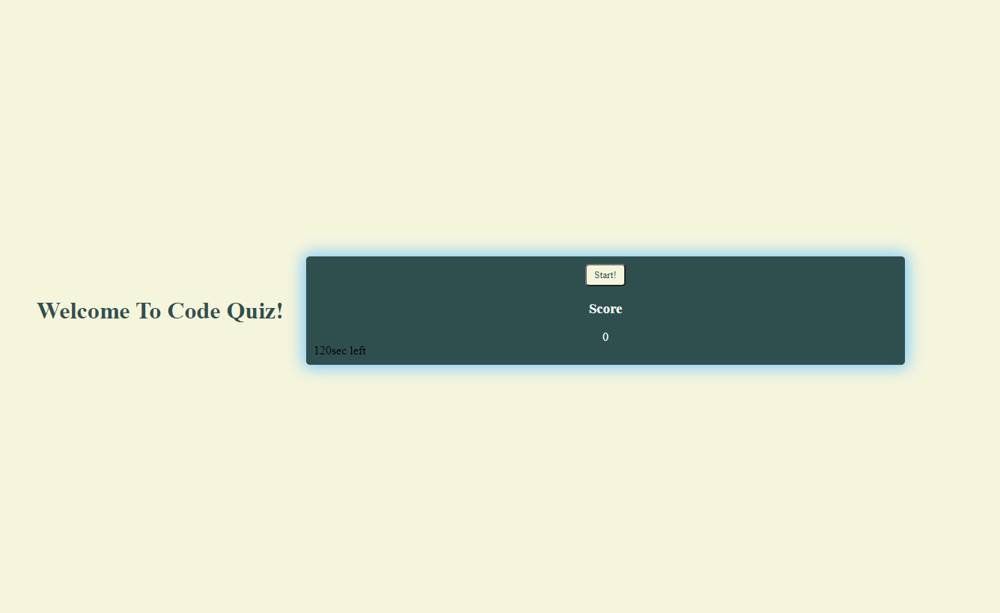
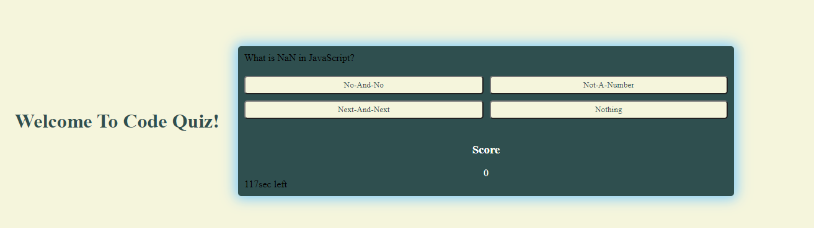

# <em> Code-Quiz <em>
#
## Description
This is a project called 'Code-Quiz' and I created this quiz users about the topic 'JavaScript' as it's the most used programming language out there! This project is unfortunately not completed but that comes with more pratice and studying to do on my part! It was a very challenging project but I learned a lot about JavaScript doing so. I'm actually happy with the results that have been made and I will be coming back to finish this project as I progress in leanrning more about JavaScript.

 

## <em> Project Status
As previously mentioned above, this project is not fully complete due to time and knowledge in certain aspects of JavaScript. This project still needs the following. (1) points being added and time being reduced per every question being right or wrong, (2) timer starting when user clicks 'start' instead of starting as page loads, 
(3) input option for user at the end of the quiz to track scores on scoreboard. This project was fun to create and excited to finally complete it coming soon!

 

## <em> Learning Points
<li> How to 'hide' buttons upon clicks being made by the user.

<li> How to loop and generate random arrays of set questions.

<li> Better understanding of 'eventListeners' and 'append'

 

 Webpage when loaded in.

 First question being displayed. 

 

## <em> License <em>
[MIT](./license.md)
